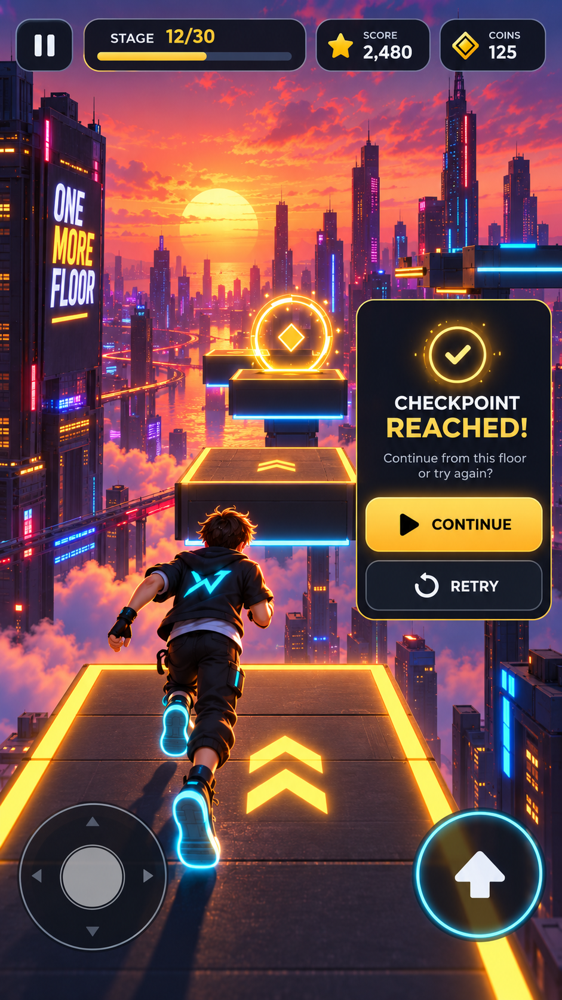

# Rising Steps Art Direction

## Target
Bright fantasy sky realms that remain feasible on mobile: authored grass/rock islands, warm gold route glow, cyan sky, soft clouds and one portal focal point.

## Palette
- Sky cyan: #47A9FF
- Cloud: #F5FBFF
- Grass: #68A94C
- Rock: #6E687E
- Gold route: #FFD43D
- Purple Shop: #7A35F5
- Orange Daily: #FF8A1E
- Blue Style: #1598FF
- Navy UI: #0A2342

## World
- 12 clear platforms per realm.
- Larger destination island and glowing portal.
- Decorative islands/waterfalls remain non-colliding.
- Final production art uses optimized authored meshes and atlas materials.

## UI
Top-left: settings, inbox, audio.
Top-center: Height 0/12 progress.
Top-right: crystal currency.
Left middle: Shop, Daily, Style.
Bottom: joystick left, jump right.
The center route remains unobstructed.

## Primary visual reference

This image is the binding visual target for the sky-realm palette, floating-island silhouettes, vegetation, waterfalls, route glow, portal/temple destination and HUD hierarchy. It is not permission to keep Shop, Daily and Style permanently over gameplay; these are contextual controls/panels and the climb route must remain clear.

### Non-negotiable visual gates
- Islands must read as authored grass/rock landforms, not block platforms.
- Decorative vegetation and waterfalls create scale while remaining non-blocking and mobile-budget aware.
- Gold route lighting identifies the climb; the sky stays bright, soft and optimistic.
- The destination temple/portal must remain a visible long-range focal point.
- Character, islands and UI require a coherent non-Roblox visual language.

